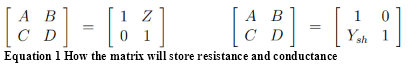
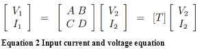
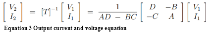
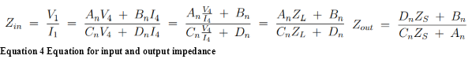
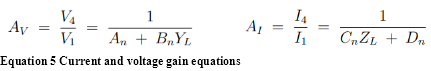
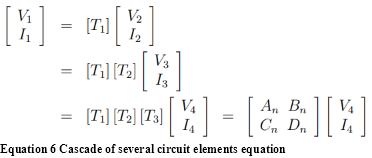
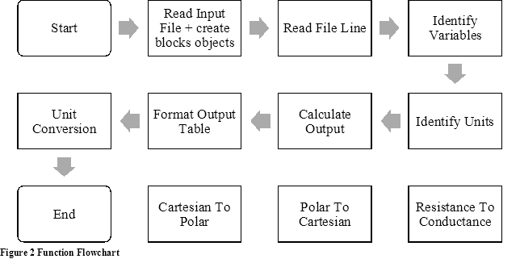
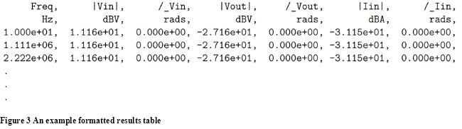
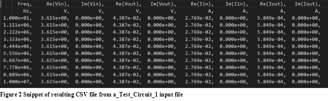

# EE20084 Structured Programming Coursework

## Design Document

|University of Bath|
| :--- |
|Design Document|
|EE20084 Structured Programming|
|<p>George Madeley</p><p>3-12-2021</p><p></p>|

### Introduction

The task is to design a circuit analysis software where connected series and shunt resistors of any value can be in any order between source and load. The program must accept an input file, in XML format, containing three sections describing the circuit, the terms and the requested outputs. The program must identify the given resistance and conductance values between nodes given in the input file’s circuit description section. The program must also identify the input parameters, Thevenin’s voltage and resistance or Norton’s current and resistance. From this information, the code should be able to calculate the requested information, stipulated in the ‘output’ section on the input file, using the ABCD matrix analysis scheme. A formatted table should contain the calculated data. The top row should contain the names of each piece of information, then their units on the second row and the data collected after. [Figure 3](#_ref66040643) shows an example of this table.

In addition to this, there are numerous extension tasks that the code may process. The input parameters may include exponent prefixes that the program should use to alter that component value. The output section may also include exponent prefixes. The program should convert the requested information into the requested exponent. The output value may also be requested to be in decibels. From this information and the unit, the program should convert the output value into decibels. The output table should change to accompany these unit alterations. If specified by the input file, the table should layout frequencies in a logarithmic format.

### Method


<a name="_ref66040268"></a>**Figure 1 Example Circuit with circuit blocks**

By analysing the problem, the program can is into three distinct sections: read the file, perform calculations, format data. Each section will utilise data collected from the read file section of the code. Due to the amount of data and the different types, a custom class will store circuit subsections information.

#### Class

The class, named ‘Block’, will represent a block of the circuit between two nodes. For instance, in the example circuit seen in [Figure 1](#_ref66040268), an instance of the class can represent the resistor Z3 situated between nodes two and three (block 3). These classes can then calculate input and output voltage, current, power, impedance, and gain at that part of the circuit and the whole circuit.

##### Attributes

The object will contain attributes relating to the voltage and current in and out, along with the ABCD matrix.

|Name|Type|Description|
| :- | :- | :- |
|```inputVoltage```|Float List|This is a list the input voltage to a block in the format of a float list of length bigger than zero. If the list has one element, the voltage is DC; else, it is AC.|
|```inputCurrent```|Float List|This is a list the input current to a block in the format of a float list of length larger than zero. If the list has one element, the current is DC; else, it is AC.|
|```outputVoltage```|Float List|This is a list the calculated output voltage from the block.|
|```outputCurrent```|Float List|This is a list the calculated output current from the block.|
|```matrixABCD```|Float Matrix|This is a matrix containing four elements corresponding to A, B, C, and D in the matrix in that order. This matric represents either series impedance (equation four from laboratory script) or shunt admittance (equation five from laboratory script).|

<a name=""></a>**Table 1 object attributes**

##### Methods

The class methods will calculate the voltage, current, impedance, gain, and power in and out of the resistor.



<a name=""></a>**Equation 1 How the matrix will store resistance and conductance**

**Calculate Output Voltage –** The method calculates the output voltage from the given “inputVoltage”, “inputCurrent”, and “matrixABCD”. This method will utilise the inverted voltage equation ([Equation 3](#_ref66052929)) from chain matrix analysis, which returns a list of the output voltages from that circuit block. The method raises an exception if the values of A\*D and B\*C are the same as nothing can be divided by zero. Three tests will be conducted. The first will provide the method with a series of different predetermined values of the class attributes and see if the methods calculate the correct output voltage. The second test will provide the method with only some of the class attributes and see if the method can still calculate the correct output voltage or raise an exception if there is not enough data. The third will provide the method with data that is the incorrect data type that the method accepts. For example, passing in a string when the method only accepts integers, floats, and doubles. The method is accepted to raise the invalid data type exception.



<a name=""></a>**Equation 2 Input current and voltage equation**

**Calculate Output Current –** This method calculates the output current from the given data in “inputVoltage”, “inputCurrent”, and “matrixABCD”. The method will utilise the inverted voltage equation ([Equation 3](#_ref66052929)) from chain matrix analysis. This calculation returns a float list of the output voltages from that circuit block. The method raises an exception if the values of A\*D and B\*C are the same as nothing can be divided by zero. Three tests will be conducted. The first will provide the method with a series of different predetermined values of the class attributes and see if they calculate the correct output current. The second test will provide the method with only some of the class attributes and see if the method can still calculate the correct output current or raise an exception if there is not enough data. The third will provide the method with data that is the incorrect data type that the method accepts. For example, passing in a string when the method only accepts integers, floats, and doubles. The method is accepted to raise the invalid data type exception.



<a name="_ref66052929"></a>**Equation 3 Output current and voltage equation**

- **Calculate Power –** This calculates the input and output power from the data in “inputVoltage”, “inputCurrent”, “outputVoltage”, and “outputCurrent”. The method will utilise the chain matrix analysis. If an attribute is missing, the code will raise an exception or call the “CalculateOutputVoltage/Current’ method to get the required data. This calculation returns a list of the circuit block’s input power and a list of the block’s output power. Three tests will be conducted. The first will provide the method with a series of different predetermined values of the class attributes and see if the methods calculate the correct input and output power. The second test will provide the method with only some of the class attributes and see if the method can still calculate the correct input and output power or raise an exception if there is not enough data. The third will provide the method with data that is the incorrect data type that the method accepts. For example, passing in a string when the method only accepts integers, floats, and doubles. The method is accepted to raise the invalid data type exception.

- **Calculate impedance –** calculates the input and output impedances from the data given in class attributes. This method will utilise the chain matrix analysis impedance equation ([Equation 4](#_ref66053021)). If an attribute is missing, the code will raise an exception or call the “CalculateOutputVoltage/Current’ method. This calculation returns two float lists; one contains the input impedances of that block, and the other contains the output impedances of that block. If the value for input current or any denominator in [Equation 4](#_ref66053021) are 0, the method raises an exception. Three tests will be conducted. This first will provide the method with a series of different predetermined values of the class attributes and see if the methods calculate the correct input and output impedance. The second test will provide the method with only some of the class attributes and see if it can still calculate the correct input and output impedance. Call the corresponding methods for missing required data or raise an exception if there is not enough data. The third will provide the method with data that is the incorrect data type that the method accepts. For example, passing in a string when the method only accepts integers, floats, and doubles. The method is accepted to raise the invalid data type exception.



<a name="_ref66053021"></a>**Equation 4 Equation for input and output impedance**

- **Calculate Gain –** This method calculates the block’s voltage and current gain using the given class attributes. This method will utilise the chain matrix analysis current and voltage gain equation ([Equation 5](#_ref66053057)). If an attribute is missing, the code will raise an exception or call the “CalculateOutputVoltage/Current’ method. This calculation returns two floats; one containing the voltage gain from the input to the block’s output voltage, and the other will contain the current gain from the input to output voltage of the block. If the value for input current, input voltage, or any denominator in [Equation 5](#_ref66053057) are 0, the method raises an exception. Three tests will be conducted. This first will provide the method with a series of different predetermined values of the class attributes and see if the methods calculate the correct voltage and current gain. The second test will provide the method with only some of the class attributes and see if the method can still calculate the correct voltage and current gain or raise an exception if there is not enough data. The third will provide the method with data that is the incorrect data type that the method accepts. For example, passing in a string when the method only accepts integers, floats, and doubles. The method is accepted to raise the invalid data type exception.



<a name="_ref66053057"></a>**Equation 5 Current and voltage gain equations**

From these attributes and methods, multiple circuit blocks can be created and called upon when needed to identify voltage, current, or power in different parts of the circuit. Each of these blocks would be linked together so that the output voltage and current of one block would be the input voltage and current to another block. Lists store the values of the voltages and currents. The lists passed from one block to the next block will not be copied but only create a new pointer to the memory address. This allows us to change the information in block two and have all data automatically updated once called via recursion. (i.e. The voltage, of block seven points to the output voltage of block six, which requires the same block’s input voltage, which points to the output voltage of block five et cetera). This uses the cascade of several circuit elements from [Equation 6](#_ref66052865).

<a name="_ref66052865"></a>

<a name="_toc66050350"></a>**Equation 6 Cascade of several circuit elements equation**

#### Functions

The following are the three parts that make up the code: reading the file, calculating requested values, formatting the data. Each has a series of various functions which flow in a specific order, as seen in [Figure 2](#_ref66040690). Three functions are not included in the flow as they will be called numerous times throughout the code.



<a name="_ref66040690"></a>**Figure 2 Function Flowchart**

**Main –** The program calls this function first. The method calls the Read Input File function and passes the circuit file’s name into that function. That function returns a 2D-array containing information about the required outputs, their units and their exponents, a list of the created blocks, and a list of frequency information. From this, it calls the Calculate Outputs function and passes the returned data. That function returns a 2D-Array containing all the calculated values. The Format Output Table function formats that 2D-array into the desired format.

Arguments:

- (string) The filename of the circuit file to be analysed

Returns:

- (2D-Array) the table containing the desired information of the circuit.

Testing

- Big Bang integration testing to identify how each component interacts with each other.
- System testing to evaluate the systems compliance with the specification.
- Both these test will utilise the provided test files on Moodle.

**Read Input File –** This reads the input test file to identify the required outputs and the given inputs. Loop over each line of the input and call the Read File Line function. If the line is in the \<CIRCUIT> section, call create an instance of the ‘Block’ class and store the object in a list. If the line is in the \<TERMS> section, create a new ‘block’ object with Thevenin’s Voltage and resistance or Norton’s current and resistance, and another for the load resistance. The function adds these two objects to the object list. The function orders the object list, so the source block goes first, and the load block goes last. [Figure 1](#_ref66040268) shows the order. The function defines the order by the concatenation of the first and second nodes name (n1 + n2). i.e. nodes ‘20’ will be before nodes ‘23’. Additionally, create a list of information regarding the frequencies. Find the \<OUTPUT> section and identify the required outputs by calling the Identify Units function. Store the required outputs, units, and power in a 2D-array. The function uses a while loop to read each line in each section as the number of lines is unknown and a linear search to search for each sections’ headers and footers.

Arguments:

- (string) The filename of the circuit file to be analysed

Returns:

- (2D-array) the required outputs, their units, and their exponents.
- (List) the list of circuit blocks created in order.
- (List) frequency information

Testing:

- Pass in a filename that exists and see if the desired output is correct.
- Pass in a filename that does not exist, or the data is of the wrong type to see if the function raises an exception without breaking the program.
- Pass in a filename that does exist but does not contain one of the three sections, i.e. \<CIRCUIT>, \<OUTPUT>, or \<TERMS>, and see if it raised an exception and points to the missing section.
- Reorder the sections in the file and determine if the program can still identify each section.

**Read File Line -** Read a given line from the input file. Split up the given string using spaces input into multiple lists containing each variable and its value. Pass each list to the Identify Variables function using a loop. The function uses an if clause to identify if the line beings with ‘#’ denoting that line as a comment and irrelevant to the function.

Arguments:

- (String) A string of the given line in the file.

Returns:

- (List) A list containing the name of the variables and their value

Testing:

- The programmer will pass a string of data from a line in the test file to the function and check if it has split up the string correctly.
- The programmer will pass a string of data from a line in the test file to the function without any spaces and check if it has not split up the string.
- The programmer will pass in a value of the incorrect type to see if the function raises an exception.

**Identify Variables -** Read the line and identify the given variables in that line and assign them with the correct value by looping over each element in the list. The function will need to convert the value into the correct type. The function utilises try clauses to identify if a character is a float or a string without causing error.

Arguments:

- (String List) a list of strings to identify the variable and value of that variable

Returns:

- (float) returns the value of the variable
- (string) name of the variable

Testing:

- Pass a list of strings containing just the variable name and see if it can identify that variable
- Pass a list of strings containing just the values and see if it can convert those values into the correct data type
- Pass a list of strings containing both the variable name and value separated by a space and see if it can do the above
- Pass a list of strings containing both the variable name and value separated by an equal’s sign and see if it can do the above

**Identify Units -** Identifies the units of the given string (V, Amps, Ohms). Also identifies the power (milli, kilo, mega, et cetera). The function uses if clauses to differentiate between the name and the unit of the output. The function uses a linear search to find the exponents corresponding float value from a lookup table..

Arguments:

- (String List) A list of strings to be used to identify the outputs, the units, and the power

Returns:

- (String) name of the output, i.e. VoltageIn, GainCurrent, Power, et cetera.
- (float) the exponent of that output i.e. (0.0001, 1000, 1\*10^6)
- (string) the unit, i.e. V, dB, Ohms

Testing:

- Pass in a prefix for a unit of measure, i.e. K, m, n, M (kilo, milli, nano, mega) and identify if it returned the correct value for that prefix, i.e. 1000, 0.001, -1\*10^-9, 1\*10^6 et cetera. If the programmer passes an unidentified prefix, raise an exception without breaking the program.
- Pass in a string list to see if it can identify the name of the variable
- Pass in a string list to see if it can identify the unit of the value

**Calculate Outputs -** Loops through each block in the list to calculate the output voltage and output current by using each blocks’ method. This is how the equation of cascade of several circuit elements ([Equation 6](#_ref66052865)) operates. From that information, it will call the block methods to calculate the requested information. The function utilises if clauses to identify which data needs to be required from the 2D-array of output elements then calls the blocks corresponding method. The function uses a while loop until all the required data has been calculated.

Arguments:

- (List) the list of created blocks of the circuit to be used to calculate the required outputs
- (2D-array) the array of output elements required their units and their power.

Returns:

- (2D-array) an array of all the values calculated.

Testing:

- Test to see if power (in/out), voltage(in/out), current(in/out), gain(voltage/current), and impedance(in/out) were calculated correctly with given set values.
- Test to see if the code knows which variables (power, voltage, gain) are required by the output.
- Test to see if the code can calculate only the required variable information.
- Test to see if the information is in a list in the correct order.
- Pass over fake/missing data to see if the function can raise an exception without breaking the program.

**Format Output Table -** Format the information into the correct format as desired by the lab script. Calls the Unit Conversion function to convert the calculated values into their desired format (decibels, milli, kilo). An if clause is used by the function to identify the required data’s unit. This function may also need to call the Polar to Cartesian and Cartesian to Polar functions. The function uses an if statement to identify if a logarithmic or linear frequency is required. The first column of the table will list the frequencies linearly or logarithmically.

Arguments:

- (2D-array) the calculated values.
- (2D-array) the desired output values, their units, and their exponent.
- (List) the list of frequency information.

Returns:

- (2D-array) the formatted desired 2D-array

Testing

- Test to see if the table is in the correct format.
- Pass fake/missing data to see if the function can raise an exception without breaking the program.

**Unit Conversion -** Converts a value to its desired power. i.e. 5V = 5000mV if the given input is false. Else, it will convert it into Decibels. This function may also need to call the Polar to Cartesian and Cartesian to Polar functions.

Arguments:

- (float) the value to be converted
- (float) the power
- (string) unit of the value to be converted
- (bool) whether it is in decibels

Returns:

- (float) the converted value

Testing:

- Test to see if the input value can be multiplied correctly by the power by passing in predetermined values for the converted value and exponent and comparing the results to hand calculated results.
- Test to see if the input value can be converted into decibels bypassing predetermined values for the converted value and unit and comparing the results to hand calculated results.
- Test to see if it can identify whether it should convert the value into decibels or multiply it by the power by providing predetermined values for all inputs and comparing the results to hand calculated results.
- Pass in fake data to see if it can raise an exception without breaking the program.

**Cartesian to Polar -** Converts the given inputs from Cartesian form to polar form. The function uses an if clause to identify if the real value is 0 and raises an exception as you cannot divide a number by 0.

Arguments:

- (float) the real value.
- (float) the imaginary value.

Returns:

- (float) the value for magnitude.
- (float) the value for phase.

Testing

- Pass in values to see if their polar counterparts can be calculated correctly. The magnitude will always be equal to or larger than zero. If the imaginary value is zero, the phase will be zero.
- Pass in fake/missing data to see if the program can raise an exception without breaking the program. If the real value is zero, the function should raise an exception

**Polar to Cartesian -** Converts the given inputs from polar to Cartesian form.

Arguments:

- (float) the value for magnitude.
- (float) the value for phase.

Returns:

- (float) the real value.
- (float) the imaginary value.

Testing

- Check if the Cartesian form is correct, given a set of polar values. If the phase is 0, π, 2π, or any multiple of π, the imaginary value will return 0 and the real value will be indistinguishable from the magnitude value. If the phase is π/2, 3π/2, 5π/2, or any other multiple of π plus π/2, the real value will return 0 and the imaginary value will be indistinguishable from the magnitude value.. If the magnitude is 0, both values will return 0.
- Pass in fake/missing data to see if the program can raise an exception without breaking the program.

**Resistance to Conductance -** Converts resistance into conductance or vice versa as the conversion equation is the same. The function uses an if clauses to check if the input is a zero. If so, the function calls an exception as nothing can be divided by zero. The function uses an if clauses to check if the input is a negative as you cannot have negative resistance or conductance.

Arguments:

- (float) the resistance or conductance to be converted.

Returns:

- (float) the calculated conductance or resistance.

Testing

- Check if the value calculated is correct, given a set of inputs. Any input larger than one will result in a value between zero and one, and vice versa.
- Pass in fake/missing data to see if the function can raise an exception without causing the program to break. A negative value should raise an exception as only positive integers, doubles, and float are allowed.
- Pass in a zero to see if an exception was raised.

### Conclusion

By utilising these functions, the Main function can accept a filename for a given circuit file and read the file’s data to create small chunks of the circuit by using a custom class. Each block’s methods can then calculate the circuits output and input voltages, current, power, impedance, and gain. These values can be converted into the desired units and stored within a formatted table. The Main function can then return this table of results.  



<a name="_ref66040643"></a>**Figure 3 An example formatted results table**

The program also aims to complete certain extended features like handling unit exponent prefixes, conversion to decibels, and logarithmic frequency as seen in the Unit Conversion function and Format Output function.

## Evaluation

### Design Introduction

The programmer coded the software using a systematic approach. First, each function was defined and their description written by the programmer. They then started coding the functions from the bottom up. After each function was complete, the programmer tested said function to ensure little to no error could occur. Then, the programmer could use that function for the operation of the following function. This report will follow the same systematic approach the programmer took and outline the steps taken to code and test each function and the program as a whole.

### Design Method

#### Reading input file

Reading the input file takes up five functions within the code: Read Input File, Read File Line, Identify Input Variables, Identify Output Variable and Identify exponent. For the reading input functions, the programmer uses bottom-up integrated testing. As a result, the programmer chose to code this way, allowing for simple black-box testing for the initial part of the programming process then use white-box testing for larger, more complex functions.

The designer programmed the Identify Exponent function first. This function would accept a string of the units prefix and output that prefixes the corresponding exponent. The function creates a dictionary where the keys are the prefixes, and the values are the corresponding keys exponent. The function uses an IF state to check if the given string is a valid key in the dictionary. If so, the function returns the corresponding exponent; else, it returns 0. The dictionary only contains prefixes from pico – tera.

The programmer passed a series of values to the function to test Identify Exponent. The following are the outputs of those tests:

|Input|Output|Correct|
| :- | :- | :- |
|5 (a non-string value)|None (printed Error message)|Yes|
|“j” (a string but not a key)|0|Yes|
|“t” (a string a valid key but lowercase)|0|Yes|
|“pn” (a string but not a valid key)|Error|No|
|“m” (a string and valid key)|-3|Yes|

<a name="_ref68482883"></a>**Table 2 Identify Exponent function tests**

The function checks the type of the input parameter to ensure it is of type string before executing the rest of the program. Suppose the argument is not of type string. In that case, the program prints an error message detailing the issue, and the function returns a value of None. When the program passes a string that is not a valid key, the program returns 0. To test all string which is not a valid key would be tedious. Therefore, the program only tested select strings. One of the selected strings was a valid key, but in the wrong case, “t” instead of “T”. The function correctly outputs 0 for all of the inputs in the wrong case. Apart from “k”, as there can be cases where the kilo unit has an uppercase “K” instead of lowercase “k”. In this case, the function returns the correct exponent of 3. To identify if a given prefix was a valid key, it would check whether the function could find the prefix from a set reference string (“pnumkKMGT”). If the program found the prefix in the string, it was a valid key; however, if the program passes a string such as “pn”, it would be found in the reference string but would not be a valid key. As a result, this test caused an error which the programmer amended. Instead, the function uses a try clause which tries to find the provided string in the dictionary. Suppose it cannot, the program raises an exception which returns a 0 as the exponent. This amendment solves the issues of passing a string such as “pn”. Finally, the programmer gives all acceptable prefixes to the function. and the function returns their correct exponent

Once the Identify Exponent function was complete, the program could use it within the following function, Identify Input Variable. The program uses this function to identify the variable and its value from a given string. It would then return a string of that variables name and a float of the variable’s value. The function checks if the given argument is of type string. It then removes all of the white space from that string. The equals sign “=” is then found in the string, and the function uses it to split up the variable name and value. If the function can not find an equals sign, the program prints an error message, and the program stops running. If the function can find the equals sign, the function splits up the string’s name and value. The function then checks to see if there is a character within the variable’s value. If so, the function presumes that the character is a unit prefix. The function calls the Identify Exponent function and passes in that character. The function removes the character from the value string. The program converts the value to a float. If an error occurs, the program raises an exception and the program prints an error message then stops operating. Else, the value is then multiplied by ten to the power of the retrieved exponent[^1]. The function returns the value and the name of the variable.

The programmer passed series of values to the function to test it. The following are the outputs of those tests.

|Input|Output|Correct|
| :- | :- | :- |
|5 (non-string)|None (error message)|Yes|
|“r = 50” (string with spaces)|“r”, 50|Yes|
|“r50” (string with no equals sign)|None (error message)|Yes|
|“r=50m” (string with valid prefix)|“r”, 5.000e-02|Yes|
|“r=50h” (invalid prefix)|“r”, 50|Yes|
|“r=50e-03” (existing exponent)|“r”, 50|No|
|“r=hi” (no numerical characters)|None,= (error message)|Yes|
|“r=m” (no numerical characters)|None (error message)|Yes|
|“r=50”|“r”, 50|Yes|

<a name=""></a>**Table 3 Identify Input Variable function tests**

Some of the tests conducted are similar to those previously mentioned. However, there are some new ones. The programmer uses a string input with spaces to see if the function can still operate with added whitespace. A function called ‘replace’ is used to remove all the whitespace from the string. Therefore, the program is not affected by the input string containing whitespace. When there is an alpha character present in the value string, the string’s last character is passed to the Identify Exponent function and removed from the value string. In the case of r=”50e-03”, the function does not remove the character, and the function reads the incorrect value. Therefore, the programmer added an extra conditional to the IF statement. This conditional checks that the found character is not “e”, used for scientific notation. This conditional prevent the error from occurring again, and the program reads the correct value.

The program now needs to read lines from a file and split up the variables in a given line. The function Read File Line accepts a string of a line from the input file. The function then splits up that string using the location of the whitespaces in the line. The function uses a while loop to loop over the following tasks:

1. The function splits up the first variable string from the other variables in the string.
1. The function passes the variable string to Identify Input Variable,  which returns the variable’s name and value.
1. The program uses a series of IF statements to check the variable’s name, i.e. (n1, n2, R, G, C, L, et cetera). Once the function finds the name, the function process the value accordingly.

Once the code has completed those tasks for each variable in the line, it creates a Circuit Block[^2] object. The function stores the object's values, which the program uses later to calculate the ABCD matrix. The function only works for lines from the ‘\<circuit>’ section of the input file, not any other section. As a result, the programmer adapted this function to read values from the ‘\<terms>’ section. However, the values read from this section do not need to be stored in an instance of the circuit block class; instead, the program stores these values in two dictionaries; terms dictionary for the given terms and frequency dictionary for the given frequency terms. The function returns the created block or the dictionaries after reading all the variables in the given line.

The programmer uses white-box testing and a series of print messages to check if the function correctly splits up the variables, identifies the variable names, and created an instance of the circuit block class or stored the values in the dictionaries.

##### Correctly splits up variables

When given a string with spaces segregating each variable, the function can split up the variables. However, if given a string with no spaces or spaces splitting up the variable name, equals sign, and value, the function passes the whole line to the Identify Input Variable function. This function returns raises an error and stops the program from operating. This test initially caused an error within the Read File Line function. Therefore, the programmer added an IF statement to check the returned value of Identify Input Variables and raised an error if either value or name was none value.

##### Identify Variable Names

When Identify Input Variable returns a variable name, the program uses the name in a series of IF statements to compare it with predefined names. When passing in a line, the programmer uses print messages within each statement that prints the variable name and value to ensure that the statements correctly identified the variables. Some examples of the predefined names are n1, n2, r, vt, et cetera. Suppose the function returns a variable name that is not from the predefined list. In that case, the program prints an error message and returns a none value. Else, suppose the variable is n1, n2, r, g, c, or l. In that case, the function stores the values in their corresponding variables: node1, node2, resistance, capacitance, and inductance. Resistance is also set to one over the value of ‘g’, the conductance[^3]. All the given tests passed. There is a slight chance of error present here. However, the Identify Input Variable function caught any possible data type error or incorrect value errors. If the program misses a variable, the program prints the correct error message.

##### Create a block instance or add it to the dictionary

Creating a circuit block instance and returning it or returning the dictionaries proved hard to calculate from the given file line. Therefore, the programmer used a boolean argument to tell the function if the line was from the ‘\<circuit>’ section or the ‘\<terms>’ section of the input file. If the variable createBlock is true, the function creates an instance of the block class. The function passes the values of inductance, capacitance, and resistance to the object's initialisation function. It passes the node values to create the objects name then returns this instance. If createBlock is false, the program returns terms and frequency dictionaries. The programmer gave a range of different lines to the function and different values for the ‘create block’ variable to test the function. The variables in the line passed do not impact the circuit block instance or the dictionaries regardless of the ‘create block value. This is because only the variables related to objects can affect those objects[^4]—the program prints the values in the circuit block instance and terms and frequency dictionaries to the terminal. Issues arose with how the program calculates the circuit blocks name. That was due to a logic error that the programmer has removed. Another problem occurred with the program wiping data in the dictionaries every time the function ran. This issue was because the program instantiated the dictionaries at the start of the function. The programmer removed their instantiation from the function and placed them in the Read File function to fix this.

The program can now read lines from the ‘circuit’ and ‘terms’ section of the input file. However, to read variables from the ‘output’ section, another function is required. This function is called Identify Output Variable. This function accepts a string containing the variable name and the unit (“vin V”). The function removes any whitespace from the left or right-hand side. It then finds the white space splitting up the variable name and unit to separate the variable name and unit. Suppose the program cannot find any whitespace. In that case, the program returns the input along with the unit “L” and exponent value of 0. It presumes that the string with no space has no unit and is, therefore, voltage, current, or power gain. If there is a space, the program splits up the string. The program stores variables unit in a variable named unit. The units  first element is sent to Identify exponent to see if the unit has a valid prefix. The function then returns the name of the variable, the unit and the exponent.

The programmer passed in the following inputs into the function to test the function:

|Input|Output|Correct|
| :- | :- | :- |
|5 (non-string type)|None (error message)|Yes|
|“vinV” (string with no spaces)|“L”, 0, “vinV”|No|
|“av” (just variable name)|“L”, 0, “av”|Yes|
|“vin V” (variable name and unit)|“V”, 0, “vin”|Yes|
|“vin jV” (invalid prefix)|“jV”, 0, “vin”|No|
|“vin mV” (valid prefix)|“mV”, -3, “vin”|Yes|
|“av m” (prefix but no unit)|“mL”, -3,”av” |Yes|

<a name=""></a>**Table 4 Identify Output Variable function tests**

Most of the test checks if the program can identify the variable name, exponent, and unit. There are two cases where the function failed the test. In the first, the programmer passes a variable string without any spaces. When the program passes a string without any spaces, the function presumes it is voltage or current gain. The function assumes only the variable name has been passed and assigns it with the unit “L”. This feature is incorrect. The programmer added conditional statements to reduce the chance of error. The programmer added a conditional statement to check if the string had the letter “a” in it. If so, it was gain. Else, it was an error. The second failed test does not remove a character from the given unit. In this case, the function presumes that the letter “j” is part of the variable unit, and the function does not remove it. The programmer intentionally left this error. Creating a database to check all adequate units would be time-consuming and inefficient.

The function, called Read Input File, can now be programmed. This function opens the input file and gets each line of the input file. It then processes each line by calling Identify Output Variable or Read File Line depending on if the line comes from the circuit, terms, or output section of the file. The function enumerates over each line in the input file. If the line beings with a ‘#’ or are empty, the function should ignore it and continue to the next line. If the line is one of the following : \<CIRCUIT>, \</CIRCUIT>, \<TERMS>, \</TERMS>, \<OUTPUT>, or \</OUTPUT>, the function changes the value of a variable named state. The program is only interested in a variable within these sections of the input file.

Furthermore, these sections determine how the program reads the variables within them. Therefore, when the program starts to read the input file, a variable named state is set to 0. Suppose the program reads ‘circuit’, ‘terms’, or ‘output’ from the line, the value of state changes to 1, 2, or 3, respectively. If the program reads ‘/circuit’, ‘/terms’, or ‘/output’, the state's value returns to 0. Suppose a line passed the comment and empty line conditionals. In that case, the function checks if the state value is 0. If so, the function ignores the line and continues to the following line.

- If the state is equal to 1, the program passes the line to Read File Line with the ‘create block’ variable set to true. The function appends the returned circuit block object to a list of circuit blocks.
- If the state is 2, the program passes the line, terms and frequency dictionaries to Read File Line with the ‘create block’ variable set to false. This function returns updated terms and frequency dictionaries.
- If the state is equal to 3, the program passes the line to Identify Output Variable, which returns the line's name, unit, and exponent. The program stores this information in a list within a dictionary named outputDict. The dictionary key is the name of the requested variable. The program uses this dictionary later to identify what variables the program needs to calculate.

Upon reading every line in the file, the function returns the output, frequency, and terms dictionary and the list of circuit block objects.

The program prints each line along with another message detailing what conditionals it passed to test the function. If it was a comment, empty line, or the state was 0, “ignored” was printed. Suppose the program changed the state's value, the program prints the new value of the state. If the program read the line in state 1, 2, or 3, the function prints the returned values. At the end of the function, the program prints the dictionaries and circuit blocklist to ensure that the function read the values correctly. [Table 5](#_ref68482513) shows the tests conducted:

|Input|Output|Correct|
| :- | :- | :- |
|“# …” (line starting with #)|Ignored message|Yes|
|“” (empty line)|Ignored message|Yes|
|“\<CIRCUIT>”|State change to 1 message|Yes|
|“\<TERMS>”|State change to 2 message|Yes|
|“\<OUTPUT>”|State change to 3 message|Yes|
|“\</CIRCUIT>”, “</TERMS>”, or “</OUTPUT>”|State change to 0 message|Yes|
|“\<INPUT>” (invalid header)|Continued (error message printed)|Yes|
|```n1=1``` ```n2=2``` ```r=47``` (line within circuit section)|Printed variable names and values|Yes|
|```vt=5``` ```rs=50``` (line within terms section)|Printed variable names and values|Yes|
|“vin V” (line within output section)|Printed variable name, unit, and exponent|Yes|

<a name="_ref68482513"></a>**Table 5 Read Input File function tests**

The function does not deal with translating the variables from a string to another data type. The function only determines what route the program should take for it to read each line correctly. This process means the majority of errors within each line are caught by the functions already covered.

#### Calculating Outputs

The circuit block class contains numerous functions to calculate the voltage, current, impedance, and power in and out of the circuit. Each circuit block instance represents a circuit element. The program calculates the component's ABCD matrix using the Calculate Matrix method, which takes a frequency input and the name, resistance, inductance, and capacitance of that block. The function determines if the component is a resistor, capacitor, or inductor by checking the resistance, capacitance, and inductance values. It determines if the component is in parallel or series by checking if the block name contains a 0. The program calculated the block's impedance and converted it to a complex number. The program stores the impedance in the B or C element of the ABCD matrix depending on whether it is in series or parallel. [Table 6](#_ref68482529) shows the tests conducted.

|Resistance|Capacitance|Inductance|Frequency|Output|Correct|
| :- | :- | :- | :- | :- | :- |
|0|0|0|0|None (error message)|Yes|
|0|0|0|50|0+0i|Yes|
|0|0|5|50|0+500πi|Yes|
|0|5|0|50|0+1/500πi|Yes|
|5|0|0|50|5+0i|Yes|
|0|5|5|50|0+500πi|Yes|
|5|5|0|50|0+1/500πi|Yes|
|5|0|5|50|0+500πi|Yes|

<a name="_ref68482529"></a>**Table 6 Calculate Matrix method tests**

Before calculating the impedance, the function checks the inputs' data type to ensure that they are of type float or a numerical data type. The function checks to ensure that frequency is not zero or less than zero to avoid divide by zero errors and other logical errors. The function automatically checks the values of resistance, capacitance, and inductance during the program execution. Suppose all resistance, capacitance, and inductance are 0. In that case, the program presumes that there is no component in this block, and the program returns a complex number where the real and imaginary parts are both 0. Suppose there are values for all resistance, capacitance and inductance. In that case, the program will find the impedance of the inductor only. If there is no value for inductance, then the program will find the impedance of the capacitor. The inductor takes priority over the capacitor, which takes priority over the resistor.

This matrix only has data on the circuit element of its corresponding block. Therefore, to calculate power, voltage, et cetera, the program needs the product of all preceding circuit block ABCD matrices in order. The program orders the list of blocks via their names, which are related to their node connections. Once the circuit block list is in order, each circuit blocks attribute, named previousBlock, is assigned to the previous circuit block in the list.

To calculate the total ABCD matrix, one would use matrix multiplication of the first two matrices, then the matrix multiplication of the result and the third matrix repeating for the following matrices. The program has a method named Total Matrix, which finds the first circuit block in the circuit by checking if the value of previousBlock is none. The first blocks matrix is returned and multiplied by the following blocks matrix. The resulting matrix is then multiplied by the following blocks matrix until the program has returned all matrices to the function caller. This process would calculate the whole circuit's ABCD matrix *if* it called the last block's Total Matrix method. The explanation for this is hard to understand. Therefore, [Figure 4](#_ref68482567) shows the code to this function.


<a name="_ref68482567"></a>**Figure 4 Code snippet from the Total Matrix method**

The programmer used the circuit from question 1-3 in the lecture notes to compare the programs total ABCD matrix to the calculated one. The programmer created two circuit blocks in the command line interface. The programmer called the methods from the latter circuit block, and the programmer compared the resulting matrix. The function passed this test.

From this, now complete ABCD matrix, the values for impedance in and out can be calculated using InputImpedance and OutputImpedance methods. These functions accept the variable impedance load and impedance source. The program can calculate the impedances in and out of the circuit. Conditional statements and except statements are present to ensure the program catches a divide by zero error and catches data type errors. From testing these methods with the circuit, the methods return the correct values. However, when testing these functions as part of the program as a whole, OutputImpedance returns the incorrect values when the programmer passes an input circuit with only resistors into the program. However, it calculates the correct values if the circuit has frequency-dependent components. Additionally, these errors from the actual value are marginal and have a difference of 10e-6Ω.

The programmer can now program the input voltage and input current methods. These functions accept the terms dictionary variable as an argument and scan it to see if it can find a value for Theivins voltage, “vt”,  or Nortons Current,  “in”. If the program finds Theivins voltage, the program calculates the input voltage using a potential divider equation with source impedance being one resistor and input impedance being another. If the program finds Nortons Current, the program calculates the total impedance of source impedance and input impedance in parallel, then multiplied by Norton's current to get the input voltage. For input current, if the program finds Thevinins voltage, the program divides the voltage source by the sum of the source impedance and the input impedance. If the program finds Nortons Current, the program calculates input voltage. Then the current over the source resistor is subtracted from Norton's current.

In some cases, the input file will not give both Thevinins voltage and Nortons current. In that case, the program prints an error message. Also, the input file may not provide load impedance and source impedance. Therefore, the program raises an exception and prints an error message stating that it could not find the values. Below are the tests:

|Input|Output|Correct|
| :- | :- | :- |
|Vt=None and in=None|None (error message)|Yes|
|Vt=5|<p>- 3.9 for InputVoltage</p><p>- 0.21 for InputCurrent</p>|Yes|
|In=5|<p>- 1.9 for InputVoltage</p><p>- 1.05 for InputCurrent</p>|Yes|
|Rs=None and rl=None|None (error message)|Yes|

<a name=""></a>**Table 7 Input Voltage and Input Current method tests**

Conditional statements are used at the start of each function to ensure the terms dictionary is the correct type. The values within it are also the correct type.

For OutputVoltage and OutputCurrent, the functions are the same. However, output voltage returns the first value in the resulting matrix, whilst OutputCurrent returns the second value. The program inverses the total ABCD matrix of the circuit. The program turns the values from InputVoltage and InputCurrent into a column matrix. The program uses their values to get the matrix containing the output voltage and current. Which value the program returns depends on the function name. The program uses IF statements and except statements to catch divide by zero errors, incorrect data type errors and other errors. As the function relies on other functions' return values, an error can only occur within the other functions. Therefore, the only tests the programmer conducted were to ensure the function returned the correct values.

|Input|Output|Correct|
| :- | :- | :- |
|termsDict != dictionary|Error message printed|Yes|
|Freqeuncy = 0|Error message printed in calculate matrix method|Yes|
|Vt = 0, or in = 0|Error message raised in input voltage and current methods|Yes|
|Vt = 5, rs = 50, rl = 50|<p>- 7.8e-01 for Output voltage</p><p>- 1.6e-02 for output current</p>|Yes|

<a name=""></a>**Table 8 Output Voltage and Output Current method tests**

The programmer could now code the functions for power. These functions call the input or output current and voltage methods depending on whether they calculate input or output power. The program multiplies these values together to get input or output power. However, from the tests shown in [Table 2](#_ref68482883), the program used the incorrect equation for power. When dealing with complex numbers, the equation for power finds the product of the voltage and the complex conjugate of the current. Therefore, the program calls a function from the NumPy library to calculate the current's complex conjugate.

|Input|Output|Correct|
| :- | :- | :- |
|<p>No complex conjugate</p><p>- Current In: 0.1-7.9e-5i</p><p>- Voltage In: 1.9e-5+0.004i</p>|Power In: 2.267e-6-0.0004i|No|
|<p>Complex conjugate</p><p>- Current In: 0.1-7.9e-5i</p><p>- Voltage In: 1.9e-5+0.004i</p>|Power In: 1.635e-6+0.0004i|Yes|

<a name=""></a>**Table 9 Input Power method tests**

However, though the function calculates the current complex conjugate, an error is present in the output power's imaginary value. Upon testing the whole program, the programmer found that the imaginary value of power out has a difference of e-20 to the actual value. The programmer did not solve this. It was presumed to be a rounding issue with either this program.

Finally, the programmer can now code the methods for voltage and current gain. The current gain function calculates the circuit's current gain using the C and D values from the total matrix and the impedance load. The voltage gain function calculates the circuits voltage gain using the A and B values from the total matrix and the impedance load. The function uses try and except statements to catch division by zero exceptions. The programmer conducted the following tests to calculate the current gain:

|Input|Output|Correct|
| :- | :- | :- |
|Load impedance of type string|None (error message)|Yes|
|<p>Load Impedance: 50</p><p>C: 0.83-25.14i</p><p>D: 1+0i</p>|3\.269-25.14i|Yes|
|<p>Load Impedance: 0</p><p>C: 0.83-25.14i</p><p>D: 0+0i</p>|None (division by zero error message)|Yes|

<a name=""></a>**Table 10 Current Gain method tests**

The programmer conducted the following experiments to calculate voltage gain.

|Input|Output|Correct|
| :- | :- | :- |
|Load impedance of type string|None (error message)|Yes |
|<p>Load Impedance: 50</p><p>A: 1+0i</p><p>B: 0+0i</p>|1+0i|Yes|
|<p>Load Impedance: 0</p><p>A: 1+0i</p><p>D: 0+0i</p>|None (division by zero error message)|Yes|

<a name=""></a>**Table 11 Voltage Gain method tests**

The programmer coded a function to calculate the magnitude in decibels and the phase of a complex number. The functions contain two arguments for the real and imaginary parts of a complex number. The function uses the atan2 function from the math module to calculate the phase. It uses the Pythagorean theorem to calculate the magnitude. The function also contains try and except statements to ensure the passed arguments are of the correct type.

|Input|Output|Correct|
| :- | :- | :- |
|Real is a string|None (error message)|Yes|
|Imag  is a string|None (error message)|Yes|
|Real = 0, imag = 0|ERROR|No|
|Real = 0, imag = 0|None (error message)|Yes|
|Real = 1, imag = 0|Magnitude = 0, phase = 0|Yes|
|Real = 10, imag = 0|Magnitude = 1, phase = 0|No|
|Real = 10, imag = 0|Magnitude = 20, phase = 0|Yes|
|Real = 0, imag = 1|Magnitude = 0, phase = 1.57|Yes|
|Real = 0, imag = 10|Magnitude = 20, phase = 1.57|Yes|
|Real = 10, imag = 10|Magnitude = 23, phase = 0.785|Yes|

<a name=""></a>**Table 12 Cartesian To Power function tests**

From the conducted tests, an error occurs when both the values passed are equal to 0. The programmer fixed this error by adding a conditional statement that prints an error message when both the real and imaginary values are 0. Another error occurred when the function returned the wrong value when the real value equalled ten, and the imaginary equalled 0. This error was because the function calculated only the magnitude, not the decibel of the magnitude. The programmer fixed this by returning the logarithm of the magnitude to base ten multiplied by 20.

The Calculate Outputs function calculates each of the requested outputs by calling their corresponding methods from the last circuit block object in the sorted block list. The function gets the last circuit block object in the list and stores it in a variable. Then, depending on the frequency dictionary values, a list is created of linear or logarithmic frequency. The function enumerates through each frequency in the list. The function checks the output dictionary and checks what keys are present. If a key is present, the function calls the keys corresponding method from the last circuit block. It passes the frequency value as an argument. This process calculates each of the requested values. Before the function appends the methods return values to a list of results, the function checks if the value needs to be in decibels or not. If so, the function calls the Cartesian to Polar function and passes the value. The function then appends the calculated answers to the results list. Once the function has calculated all the values for a given frequency, it appends the list to an array. Once the function has looped through each frequency, the function returns the results array.

The programmer ran the program as a whole to test this function. The programmer loaded in the a\_Test\_Circuit\_1 file. In addition to this, the programmer called the function to pass in variables of the wrong data type. [Table 13](#_ref68482895) shows the tests conducted.

|Input|Output|Correct|
| :- | :- | :- |
|A\_Test\_Circuit\_1|Printed the correct requested values|Yes|
|Incorrect data types for arguments|None (error message printed)|Yes|
|Incorrect data types for frequency values|None (error message printed)|Yes|
|Unknown key in output dictionary|None (error message printed)|Yes|
|Decibel test|Printed the correct requested values in decibels|Yes|

<a name="_ref68482895"></a>**Table 13 Calculate Output function tests**

The programmer conducted white-box to ensure that the Calculate Outputs function was calling the correct function. The programmer completed this by adding print messages in each conditional statement. If a key were “pout”, the function would print a message saying the function is calling the output power method.

#### Saving Results to CSV File



<a name="_ref68538253"></a>**Figure 2 Snippet of resulting CSV file from a_Test_Circuit_1 input file**

The final functions task is to format the calculated data into a CSV file. [Figure 5](#_ref68538253) shows an example of the CSV file format. The function creates lists for each row in the file. For the first two rows, field names, and field units, the function loops through the output dictionary items and checks if the unit contains “dB”. If the unit contains “dB”, the function uses the decibel format. Else, the function uses the standard format to display the field names. The program appends the unit to the field units list. Before being appended, they are concatenated with other strings to be in the correct format (i.e. “|Vin|”, “/\_Vin”, “Re(Vin)”, “Im(Vin)”).

Now, the program opens a new file from the provided filename. The function writes the field names and field units to the file. The function loops through each list in the results array and writes each list to the file. The programmer tested the function by passing in the a\_Test\_Circuit\_1 file to the whole program. [Figure 5](#_ref68538253) shows the resulting CSV file. This file did not meet the required format; therefore, it changed how it writes each CSV file element. The function converts each element in the results array, field name list, and the field units list to a string, then adjusts the minimum number of characters each string should have. If any string had less than eleven characters, the program would add whitespace to the string's left side. The program formatted the results to include scientific notation with only three decimals to prevent the floats from exceeding eleven characters. The programmer tested the program again with the a\_Test\_Circuit\_1 file. The program returned a CSV file where each element in each column aligned.

When the users want to analyse a circuit using this program, the program analyses it in the following order:

1. The program reads each line of the input file.
1. Suppose the line is within the circuit section of the input file. In that case, the function calls the read file line function. The variables within that line are split up and sent to the Identify Input Variables Function. The Identify Input Variables function returns each given variable's name and value using the Identify Exponent function. The Read File Line function uses those returned values to create an instance of the circuit block class and return it. The function adds those objects to a list of circuit block objects.
1. Suppose the line is within the terms section of the input file. In that case, the function calls the read file line function. The variables within that line are split up and sent to the Identify Input Variables function. The Identify Input Variables function returns each given variable's name and value using the Identify Exponent function. The Read File Line function then stores those values within the terms dictionary or frequency dictionary.
1. Suppose the line is within the output section of the input file. In that case, the function calls the Identify Output Variable function, which returns the variable's name, the unit, and the prefix's exponent. The function calls the Identify Exponent function to complete this task. The program stores returned values in a list stored in the dictionary where the name of each variable's name
1. Once the program has read all lines, the function returns the terms, frequency, and output dictionary and the circuit blocklist. The program sorts the list of blocks via the name of each block.
1. The program uses the frequency dictionary to calculate a range of frequencies either linearly or logarithmically. The Calculate Outputs function loops through each frequency value and then loops through each item in the output dictionary. The function calls the corresponding method from the last block for each item in the output dictionary, which returns that items value. The function repeats this for all elements in the dictionary then all the frequency values. The function returns an array of calculated values.
1. The program calls the Format Output Table function. It takes the output dictionary and converts its values into field headers and field units. The function writes these to a CSV file. The function then formats the results table and saves it to the CSV file.

| Test File Name | Pass Before amendments | Pass After amendments |
| :--- | :--- | :--- |
| a_Test_Circuit_1 | TRUE | TRUE |
| a_Test_Circuit_1C | FALSE | TRUE |
| a_Test_Circuit_BRX | FALSE | TRUE |
| a_Test_Circuit_L7 | TRUE | TRUE |
| a_Test_Circuit_Ord | TRUE | TRUE |
| b_CR | FALSE | TRUE |
| b_Pi_03 | TRUE | TRUE |
| b_Pi_03R | TRUE | TRUE |
| b_RC | FALSE | TRUE |
| b_Tee_03 | TRUE | TRUE |
| b_Tee_03R | TRUE | TRUE |
| c_LCG | FALSE | TRUE |
| c_LCR | FALSE | TRUE |
| d_LPF_B50 | TRUE | TRUE |
| d_LPF_B75 | TRUE | TRUE |
| d_LPF_B750 | FALSE | FALSE |
| d_LPF_Bess350 | TRUE | TRUE |
| d_LPF_C550 | TRUE | FALSE |
| e_Ladder_100 | FALSE | TRUE |
| e_Ladder_400 | FALSE | TRUE |
| Netlist_06 | TRUE | TRUE |
| Netlist_06G | N/A | N/A |
| Netlist_06ML | N/A | N/A |
| Netlist_06RC | N/A | N/A |

<a name="_ref68542027"></a>**Table 14 Results from all test files**

The programmer loaded the supplied test files into the program to test the whole program's functionality. The programmer utilised the auto tester program to test the program with all of the provided test files. [Table 14](#_ref68542027) shows all of the results from each supplied file. From these tests, the programmer discovered the following information:

- When the programmer loaded in a circuit that contained frequency-dependent components, the power in and out values was incorrect. This error was because the power in and out function calculates power by multiplying the input/ output current by the input/output voltage. Though this is correct when working with real values, this equation is incorrect when working with complex numbers. Instead, the programmer added the code to find the complex conjugate of the input/output current. However, when the programmer loaded in the frequency-dependent circuit file again, the imaginary power out value was incorrect. As the difference between the actual value and the calculated values was e-20, the programmer deemed this a negligible difference.
- When the programmer loaded in a circuit with no frequency-dependent components, the impedance in value was incorrect and had a difference of a factor of e-06. This error proved strange as other values such as voltage and current were correct, yet they relied on impedance value. After an investigation by the programmer, the programmer found that when the program calls the input impedance function, it passes in the source impedance instead of load impedance. However, it passed in impedance load when calling the function from within the voltage, current and other functions, explaining why the other values were correct but not the input impedance. After this change, the input impedance is correct.

- When the programmer loaded in test files d\_LPF\_B750, e\_Ladder\_100, and e\_Ladder\_400, a division by zero error occurred within the output voltage and current functions. After using white-box testing to ensure the circuit blocks were in the correct order within the list, the programmer discovered that each block's names were incorrect. The programmer designed a new equation to create the block names. Another error occurred within the Calculate Matrix method. This method determines if a component is in series or parallel if either node contains a zero for the ground plane. However, if the nodes were nine and ten, the function would presume the component is in parallel because ten contains a zero. Therefore, the programmer changed the code to check if node two equalled zero instead of checking if it contained a zero. By testing the files again, no division by zero error occurred.

### Dicussion

The programmer made numerous changes to the flow of the program since the design document:

- One of the design changes included splitting up the power, impedance and gain functions into input power, output power, input impedance, output impedance, current gain, and voltage gain. This change allowed easy readability of the program and improved the functionality of the system. However, in some cases, such as output voltage and output current functions, the same calculations were conducted.
- Another change was removing the resistance to conductance function. The programmer replaced this with a simple equation that calculates resistance by performing one over the conductance. The program only uses this equation when readings values from the input file. This decision was because the function proved inefficient. The calculation was already small and straightforward to use throughout the program.
- The polar to Cartesian function was also removed by the programmer as the program never called it.
- The programmer replaces the identify units function with the identity exponent function. The original functionality of the identify units function was to read the lines from the input file's output section and identify the units and their prefixes. However, the programmer incorporated this functionality into the Identify Output Variable function whilst the programmer incorporated the code to identify the unit prefixes into the Identify Exponent function.
- The programmer also incorporated the unit conversion function into the Calculate Outputs function using a simple equation. When the program reads the required output variables, it stores the negative value of the unit exponents[^5] in a list within the output dictionary. When the program calculates the output variables, the returns from each method of the last circuit block are multiplied by ten to the power of this stored value

### Design Conclusion

To conclude, though, there are some issues regarding the difference in the imaginary output power value and differences in the input impedance value. These differences were deemed negligible and do not significantly impact the program's overall analysis. Therefore, the programmer believes the program performs to a satisfactory level as one can use the program to analyse a circuit within the frequency domain with little to no error.

- [^1]: 0 if one could not be retrieved
- [^2]: A custom class used to create the ABCD matrix of that section of the circuit. Also used to calculate voltage, current, impedance and other requested values.
- [^3]: An error message is present to check for a divide by zero exception
- [^4]: n1 can only impact the circuit block instances, and vt can only impact the termsDict
- [^5]: If the unit was mV, the exponent would be -3, however, to convert the calculated value from V to mV, the program mutliplies the value by ten to the power of –(-3) which equals three.
